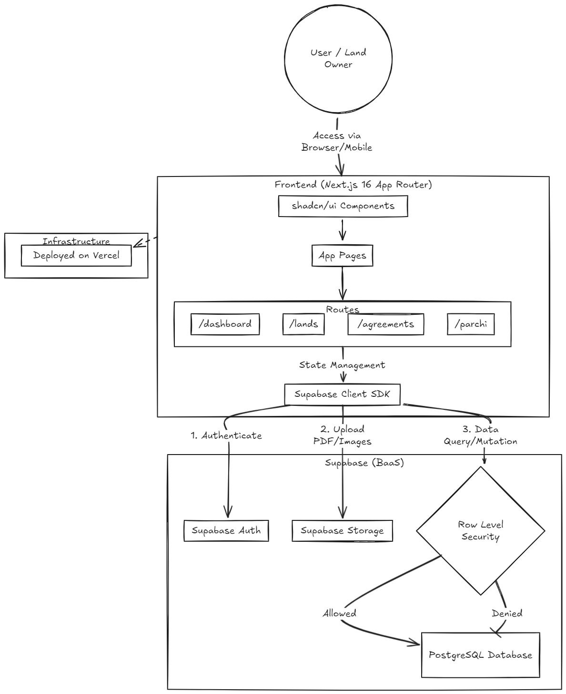
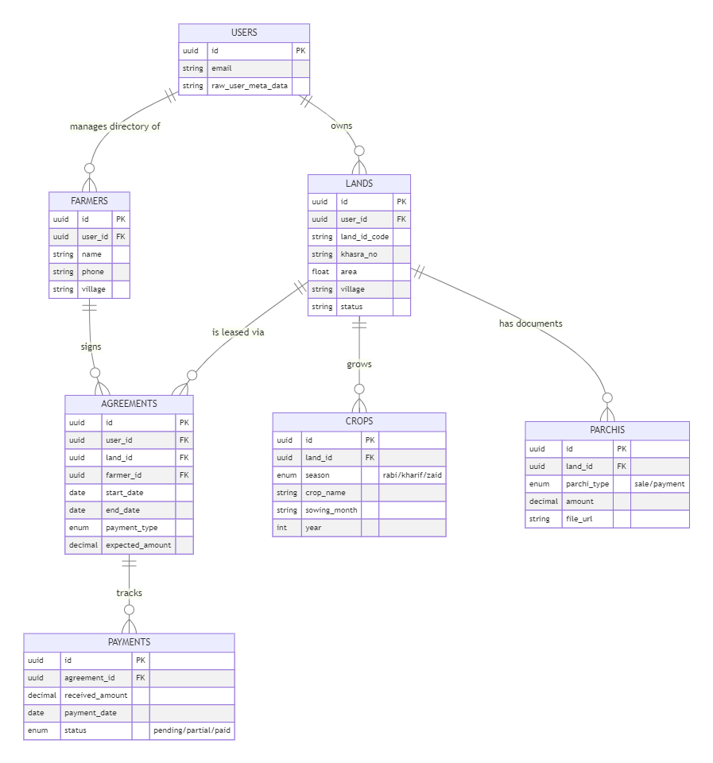

# BhoomiLog - Land & Farming Dashboard

A comprehensive agricultural management platform built with Next.js and Supabase for tracking lands, farmers, crop agreements, and payment records in India.

## Overview

BhoomiLog (भूमि लॉग) is a simplistic yet powerful dashboard designed for agricultural land owners and farm managers to efficiently manage:
- Agricultural land records with Khasra numbers
- Farmer/lessee information and contacts
- Crop agreements with payment tracking
- Seasonal crop records (Rabi, Kharif, Zaid)
- Document uploads (Parchis - agricultural sale/payment documents)
- Payment tracking and reconciliation

## Features



### Core Functionality
- **Dashboard Overview** - Summary of lands, active agreements, expected income, and pending payments
- **Land Management** - Track multiple lands with village, Khasra number, area (in acres/bigha), and assigned farmer
- **Farmer Directory** - Manage lessee/farmer information with contact details
- **Agreements** - Create lease agreements with fixed or crop-share payment models
- **Crop Tracking** - Record crops by season (Rabi/Kharif/Zaid) with sowing and harvest months
- **Document Management** - Upload and store agricultural documents (Parchis) with file previews
- **Payment Tracking** - Monitor expected vs received payments with status tracking (Pending/Partial/Paid)

### Technical Features
- **User Authentication** - Secure signup/signin with Supabase Auth
- **Row-Level Security (RLS)** - Complete data isolation per user
- **Real-time Data Sync** - Automatic data updates across components
- **Mobile Responsive** - Works seamlessly on desktop, tablet, and mobile
- **File Upload** - Support for image and PDF uploads to Supabase Storage

## Tech Stack

- **Framework**: Next.js 16 (App Router)
- **Database**: PostgreSQL via Supabase
- **Authentication**: Supabase Auth
- **Styling**: Tailwind CSS v4
- **UI Components**: shadcn/ui
- **Icons**: Lucide React
- **State Management**: React hooks with Supabase client
- **File Storage**: Supabase Storage
- **Language**: TypeScript

## Database Schema

### Tables

**users**
- Extends Supabase `auth.users`
- Stores additional user profile information

**lands**
- `id` (UUID) - Primary key
- `user_id` (UUID) - Owner reference
- `land_id_code` - Custom land identifier
- `village` - Village name (optional)
- `khasra_no` - Government land ID
- `area_acres` / `area_bigha` - Land measurements
- `farmer_id` - Assigned farmer/handler
- `details` - Additional text notes
- `status` - active/leased/inactive

**farmers**
- `id` (UUID) - Primary key
- `user_id` (UUID) - Owner reference
- `name` - Farmer/lessee name
- `phone` - Contact number
- `village` - Village name

**agreements**
- `id` (UUID) - Primary key
- `user_id` - Owner
- `land_id` - Associated land
- `farmer_id` - Associated farmer
- `start_date` / `end_date` - Agreement period
- `payment_type` - fixed/crop_share
- `expected_amount` - Monthly/seasonal payment
- `status` - active/expired/renewal_pending

**crops**
- `id` (UUID) - Primary key
- `user_id` - Owner
- `land_id` - Associated land
- `season` - rabi/kharif/zaid
- `crop_name` - Type of crop
- `sowing_month` / `harvest_month` - Timeline
- `year` - Crop year

**parchis** (Agricultural documents)
- `id` (UUID) - Primary key
- `user_id` - Owner
- `land_id` - Associated land
- `season` - rabi/kharif/zaid
- `parchi_type` - mandi_sale/payment/other
- `parchi_date` - Document date
- `amount` - Transaction amount
- `quantity_weight` - Quantity in kg/units
- `file_path` / `file_url` - Document storage

**payments**
- `id` (UUID) - Primary key
- `user_id` - Owner
- `agreement_id` - Associated agreement
- `expected_amount` - Due amount
- `received_amount` - Received payment
- `payment_date` - Payment date
- `status` - pending/partial/paid
- `notes` - Payment notes

## Setup Instructions

### Prerequisites
- Node.js 18+ and npm/pnpm
- Supabase account (free tier available)

### 1. Clone & Install

```bash
git clone <repository-url>
cd land-farming-dashboard
npm install  # or pnpm install
```

### 2. Configure Supabase

Create a Supabase project and set up environment variables:

```env
NEXT_PUBLIC_SUPABASE_URL=your_supabase_url
NEXT_PUBLIC_SUPABASE_ANON_KEY=your_anon_key
SUPABASE_SERVICE_ROLE_KEY=your_service_key
```

### 3. Initialize Database

Run the SQL schema scripts in Supabase SQL editor:

1. Execute `/scripts/01-init-schema.sql` - Creates all tables and RLS policies
2. Execute `/scripts/02-alter-lands-table.sql` - Adds farmer handling and details fields

### 4. Run Development Server

```bash
npm run dev
```

Visit `http://localhost:3000` to access the application.

## Usage Guide

### Authentication
1. Create a new account on the signup page
2. Verify your email (in development, check Supabase email logs)
3. Login with your credentials
4. Access the dashboard

### Adding Land Records
1. Navigate to **Lands** section
2. Click **Add New Land** button
3. Fill in:
   - Land ID Code (unique identifier)
   - Khasra Number (government land ID)
   - Area (in acres or bigha)
   - Village (optional)
   - Assigned Farmer (select from dropdown)
   - Additional Details (text notes)
4. Submit to save

### Managing Agreements
1. Go to **Agreements** section
2. Click **Add Agreement**
3. Select Land and Farmer
4. Choose payment type (Fixed amount or Crop share %)
5. Set agreement dates and expected amount
6. Track payment status on **Payments** page

### Uploading Documents (Parchis)
1. Navigate to **Parchi (Documents)**
2. Click **Add Parchi**
3. Select associated land and season
4. Upload image or PDF
5. Enter amount and quantity
6. Select parchi type (Mandi Sale/Payment/Other)
7. Click preview icon to view uploaded documents

### Tracking Payments
1. Go to **Payments** page
2. View summary: Total Expected, Received, and Pending
3. Click **Add Payment** to record received payments
4. Track payment status: Pending → Partial → Paid

## Security

- **Row-Level Security (RLS)**: All database tables have RLS policies ensuring users can only access their own data
- **Authentication**: Supabase provides secure OAuth and email/password authentication
- **HTTPS**: All data transmission is encrypted
- **No sensitive data in client**: API calls use server-side authentication where needed

## Deployment

### Deploy to Vercel

1. Push code to GitHub
2. Connect repository to Vercel
3. Add environment variables in Vercel dashboard
4. Deploy automatically on push

```bash
vercel deploy
```

## File Structure

```
├── app/
│   ├── dashboard/           # Protected dashboard pages
│   │   ├── page.tsx         # Dashboard overview
│   │   ├── lands/           # Land management
│   │   ├── farmers/         # Farmer directory
│   │   ├── agreements/      # Agreement tracking
│   │   ├── crops/           # Crop records
│   │   ├── parchi/          # Document management
│   │   └── payments/        # Payment tracking
│   ├── page.tsx             # Auth page
│   └── layout.tsx           # Root layout
├── components/
│   ├── ui/                  # shadcn/ui components
│   ├── add-*-modal.tsx      # Form modals
│   └── sidebar-nav.tsx      # Navigation
├── lib/supabase/            # Supabase clients and utilities
├── scripts/                 # Database migration scripts
└── styles/                  # Global styles
```

## API Routes

All data operations use Supabase client SDK with real-time listeners.

**Key operations:**
- `Create` - Insert new records with user_id
- `Read` - Fetch filtered by user_id (RLS enforced)
- `Update` - Modify existing records
- `Delete` - Remove records

## Troubleshooting

### RLS Policy Violations
- Ensure `user_id` is included in all insert/update operations
- Check that user is authenticated before database operations
- Verify RLS policies are enabled in Supabase

### File Upload Issues
- Check Supabase Storage bucket permissions
- Ensure file size is within limits
- Verify file type is allowed (images/PDFs)

### Authentication Issues
- Clear browser cookies and cache
- Check email verification status
- Verify callback URL matches Supabase settings

## Future Enhancements

- Weather data integration for crop planning
- SMS/WhatsApp notifications for payment reminders
- Crop yield analytics and reports
- Expense tracking and profitability analysis
- Mobile app (React Native)
- Multilingual support (Hindi, Punjabi, etc.)
- Offline mode with sync
